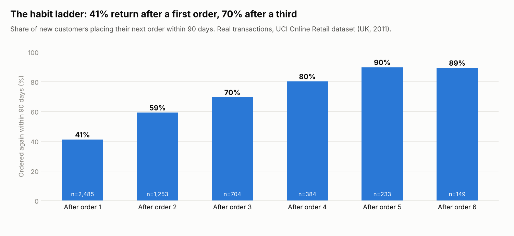
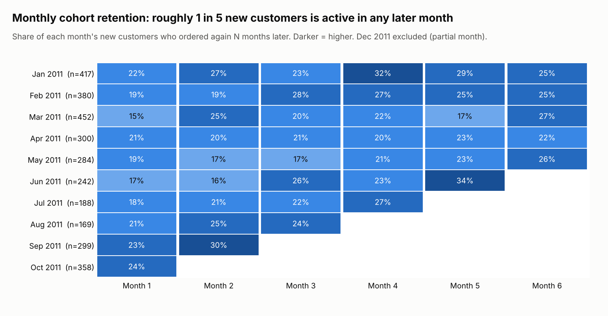

# Customer Retention Strategy – Swiggy Case Study 🍔

A product and business case on one question: **how can Swiggy keep customers ordering after the first-order
discounts end?** It moves from problem framing and customer segmentation to root causes, prioritised solutions
and a phased roadmap, and then tests the argument against evidence:

- **Real transaction data:** a cohort analysis of 541,909 invoice lines shows that only 41% of new customers
  place a second order within 90 days, but 70% of those who reach a third order come back again.
- **Real company figures:** a unit-economics model built on Swiggy's Q1 FY2027 shareholder letter shows that at an
  assumed ₹400 acquisition cost and 10% monthly churn, lifetime value covers acquisition cost only 1.2x.
- **Execution:** an implementation plan with owners and go/no-go gates, and an A/B test design with a computed
  sample size.


---

## 📋 Table of Contents

- [Problem Definition](#1-problem-definition)
- [User Segmentation](#2-user-segmentation)
- [User Journey Map](#3-user-journey-map)
- [Pain Point Analysis](#4-pain-point-analysis)
- [Root Cause Analysis](#5-root-cause-analysis)
- [Product Solutions](#6-product-solutions)
- [Metrics to Track](#7-metrics-to-track)
- [Prioritization Framework](#8-prioritization-framework)
- [Final Recommendation](#9-final-recommendation)
- [Evidence from Real Data](#10-evidence-from-real-data)
- [Unit Economics](#11-unit-economics)
- [Implementation and Testing](#12-implementation-and-testing)
- [Data, Sources and Repository](#13-data-sources-and-repository)

---

## 1. Problem Definition

### Problem Statement
> *"How might we improve the retention rate of Swiggy users beyond the initial discount-driven orders, to increase monthly order frequency and lifetime value — without solely relying on offers?"*

### Key Observations
- **Hypothesis:** Swiggy acquires users effectively but loses many of them in their first few orders. Real
  transaction data supports the pattern: only 41% of new customers order again within 90 days, while 70% of
  customers who reach a third order come back again ([Section 10](#10-evidence-from-real-data)).
- **Hypothesis:** retention drops once the discount period ends. Swiggy does not publish order-level discount
  data, so this is tested directly in the A/B test design by splitting results by discounted vs full-price first
  orders.
- **Unit economics are tight:** at Swiggy's reported Q1 FY2027 food-delivery margin, an average active user
  generates about ₹51 of Adjusted EBITDA a month. At an assumed CAC of ₹400 and 10% monthly churn, lifetime value
  covers acquisition cost only 1.2x, against the usual 3x benchmark ([Section 11](#11-unit-economics)).

### Goals
| Goal | Target Metric |
|------|---------------|
| Improve habitual usage | Increase orders/user/month |
| Reduce churn | Improve D30 retention rate |
| Reduce discount dependency | Grow non-coupon order % |
| Improve experience quality | Raise post-order NPS |

---

## 2. User Segmentation

### Segment 1 — Discount Chasers 🔴
- Order **only when coupons are available**; high churn post-offer
- Typically new users, students, or price-sensitive demographics
- **Churn trigger:** Offer expires or competitor has a better deal
- **Retention lever:** Loyalty programs, value bundles, Swiggy One perks

### Segment 2 — Convenience Seekers 🟡
- Order **1–2x/week** for convenience (busy professionals, working couples)
- Drop off when delivery time is slow or food quality is inconsistent
- **Churn trigger:** 2–3 bad delivery experiences in a row
- **Retention lever:** Speed guarantees, Swiggy Bolt, reliable restaurant curation

### Segment 3 — Power Users 🟢
- Order **4+ times/week**; high LTV, likely Swiggy One subscribers
- Churn when personalization feels stale or app experience degrades
- **Churn trigger:** Better recommendation engine on a competitor app
- **Retention lever:** Personalization, exclusive benefits, gamification

### Segment 4 — Dormant Users 🔵
- Ordered **1–3 times, then went silent** (30+ days inactive)
- Often left due to a bad first experience or switched to Zomato
- **Churn trigger:** Single bad experience with no recovery
- **Retention lever:** Win-back campaigns, re-engagement nudges, personalized re-intro

---

## 3. User Journey Map

```
[1] Discovery
     └── Opens app / sees push notification or ad
          |
[2] Browse & Search
     └── Scrolls feed, searches cuisine or restaurant
          |
[3] Restaurant Selection
     └── Checks ratings, delivery time, menu photos
          |
[4] Cart Building
     └── Adds items, applies coupon, reviews total
          |
[5] Checkout & Payment
     └── Selects delivery address, chooses payment method
          |
[6] Live Tracking
     └── Watches real-time order status and delivery map
          |
[7] Delivery & Unboxing
     └── Receives food, checks order accuracy
          |
[8] Post-Order
     └── Rates food/delivery → Re-orders or churns
```

---

## 4. Pain Point Analysis

| Stage | Pain Point | Severity |
|-------|-----------|----------|
| Discovery | Generic push notifications; "order now" fatigue | 🟡 Medium |
| Browse & Search | Repetitive feed; hard to discover new restaurants | 🔴 High |
| Restaurant Selection | Inconsistent ratings; prep time not surfaced clearly | 🟡 Medium |
| Cart Building | Coupon confusion; hidden platform fees | 🔴 High |
| Checkout | Saved address errors; no ETA confidence at checkout | 🟡 Medium |
| Live Tracking | Inaccurate ETAs; no recourse when delays occur | 🔴 High |
| Delivery | Wrong/missing items; cold food; no easy resolution | 🔴 High |
| Post-Order | No follow-up nudge; slow refunds; no re-order shortcut | 🔴 High |

---

## 5. Root Cause Analysis

### RCA 1 — Discount Dependency 🔴
- Growth KPIs historically prioritized **acquisition over retention**
- Users are **trained to expect offers**; no non-discount value communicated
- No loyalty mechanic to create **switching costs**

### RCA 2 — Poor Personalization 🟡
- Feed shows same restaurants daily; **no context-awareness** (time of day, weather, past orders)
- Recommendations not updated fast enough after first few orders
- No proactive nudges like *"your usual?"* at the user's typical lunch hour

### RCA 3 — Inconsistent Delivery Experience 🟡
- ETA accuracy is low; **no proactive communication** on delays
- Issue resolution (wrong/missing items) takes too many steps and too long
- Post-bad-experience recovery is poor — **no automatic goodwill credits**

### RCA 4 — Weak Post-Order Engagement 🔵
- App engagement drops to **zero between orders**
- No content or social layer to build habit loops
- Re-order flow is buried in the UI; **no "repeat last order" shortcut** on the homescreen

---

## 6. Product Solutions

### P0 — Quick Wins (High Impact, Low Effort)

#### 6.1 Smart Re-order Widget
- **"Your usual?"** widget on homescreen — one-tap re-order of last 3 items at typical order time
- Contextual push notification: *"It's 1 PM on a weekday — your biryani place has 20 min delivery today"*
- Implementation: ML model on order history × time-of-day × day-of-week

#### 6.2 Proactive Issue Resolution
- **Auto-detect late orders** (>15 min past ETA) → proactively apply ₹30 credit — no user action needed
- **"Missing item?"** one-tap flow directly on the order tracking screen, resolved in <2 minutes
- Post-bad-experience re-engagement: *"We're sorry — here's ₹50 for your next order"* (auto-triggered)

---

### P1 — Big Bets (High Impact, High Effort)

#### 6.3 Contextual Personalization Engine
- Feed ranked by **time-of-day + weather + past order history** (not just restaurant popularity)
- **"Explore mode" toggle** — surfaces only restaurants the user has never ordered from
- **Restaurant health score** visible: *"98% accuracy last 30 days, avg 28 min delivery"*

#### 6.4 Swiggy One Lite — Low-friction Loyalty Tier
- **Free 30-day trial** triggered after user's 3rd order; frictionless upgrade with ₹ saved calculator
- **"Swiggy Coins"** earned per order, redeemable for delivery fee waiver (no minimum order threshold)
- Milestone unlocks: *"You've ordered 10 times — enjoy free delivery for a week"*
- **Weekly order streak tracker** with a small reward (₹20 credit at 4-week streak)

---

### P2 — Retention Boosters (Medium Impact, Medium Effort)

#### 6.5 Social & Content Layer
- **"What's trending near you"** feed — short food reels from partner restaurants
- **Share & earn:** Refer a dish to a friend, both get ₹30 off (non-discount habit hook)
- **Weekly "Food Wrapped"** — personalized stat card: *"You ordered biryani 11 times this month"*

---

## 7. Metrics to Track

### Primary Metrics
| Metric | Why It Matters |
|--------|---------------|
| **D30 retention rate** | Core health signal; % users who order again within 30 days |
| **Orders / user / month** | North Star — measures habit formation |
| **Re-order rate within 7 days** | Leading indicator of habit; faster feedback loop |

### Supporting Metrics
| Metric | Target |
|--------|--------|
| Churn rate by segment | Track discount chasers vs convenience vs power users separately |
| Issue resolution CSAT | % users satisfied with refund/delay handling → target >80% |
| Swiggy One conversion rate | Free trial → paid subscriber → target >15% |
| Feature adoption rate | % users using "Your usual?" widget within 30 days of launch |
| Average order value (AOV) | Ensure retention doesn't come at margin cost |

### Guardrail Metrics (Must Not Regress)
- Delivery partner satisfaction score
- Restaurant partner GMV distribution
- App crash rate / P99 load time

---

## 8. Prioritization Framework

### RICE Prioritisation

Reach, Impact, Confidence and Effort are rated qualitatively (High / Medium / Low) as a structured judgement, not
measured values; the stars summarise the overall priority.

| Feature | Reach | Impact | Confidence | Effort | Priority |
|---------|-------|--------|------------|--------|------------|
| Re-order widget | High | High | High | Low | ⭐⭐⭐⭐⭐ |
| Auto-credit delays | High | High | High | Low | ⭐⭐⭐⭐⭐ |
| One-tap issue resolution | High | High | High | Low | ⭐⭐⭐⭐⭐ |
| Personalization engine | High | High | Medium | High | ⭐⭐⭐⭐ |
| Swiggy One Lite | Medium | High | Medium | High | ⭐⭐⭐⭐ |
| Streak + Coins gamification | Medium | Medium | Medium | Medium | ⭐⭐⭐ |
| Food Wrapped card | High | Low | High | Low | ⭐⭐ |
| Social content reels | Medium | Low | Low | High | ⭐ |

### Impact vs Effort Matrix

```
High Impact │ Quick Wins ✅      │  Big Bets 🎯
            │ · Re-order widget  │  · Personalization engine
            │ · Auto-credits     │  · Swiggy One Lite
            │ · Issue resolution │  · Streak gamification
────────────┼────────────────────┼──────────────────────────
Low Impact  │  Fill-ins 📌       │  Deprioritize ❌
            │ · Food Wrapped     │  · Social reels
            │ · Explore mode     │  · In-app communities
            │ · Health score     │  · Pre-placement orders
            │      Low Effort    │       High Effort
```

### Phased Roadmap

| Phase | Timeline | Focus |
|-------|----------|-------|
| Phase 1 | Month 1–2 | Quick wins: Re-order widget, auto-credits, one-tap issue resolution |
| Phase 2 | Month 3–4 | Big bets: Personalization engine v1, Swiggy One Lite free trial, streak system |
| Phase 3 | Month 5–6 | Scale: Gamification expansion, social referral, Food Wrapped launch |

---

## 9. Final Recommendation

### TL;DR
> Swiggy's retention problem is **not a pricing problem — it's a trust and habit problem.**  
> Fix the experience → Build the habit loop → Create switching costs.

### The 3-Step Strategy

1. **Fix trust first** — Auto-credits for delays and one-tap issue resolution rebuild trust quickly. A single bad experience with no recovery is the main churn trigger for Dormant Users (Segment 4). This is the highest-leverage, lowest-cost intervention, provided credits are capped per user (see the implementation plan).

2. **Build habit loops** — The "Your usual?" widget and order streaks are low-cost nudges that create the daily check-in habit, retaining users even without offers.

3. **Create switching costs** — A contextual personalization engine and a Swiggy One Lite loyalty tier reduce price sensitivity and make switching to Zomato feel costly over time. The tier is offered **only to users before their third order**: the unit-economics model shows a benefit given to every user would need monthly churn to fall from 10% to about 4.6% just to break even.

### What to Avoid
- ❌ **Doubling down on coupons** — solves the symptom, worsens the root cause
- ❌ **Building social features before fixing core experience** — premature complexity
- ❌ **Optimizing only for GMV** — can be inflated by discounts while retention crumbles

---

## 10. Evidence from Real Data

Swiggy does not publish customer-level data, so the core claim (retention is decided in the first few orders) is
tested on the **UCI Online Retail dataset**: 541,909 real invoice lines from a UK online retailer, Dec 2010 to
Dec 2011, covering 3,453 customers acquired in 2011. Code: `analysis/cohort_retention.py`. The dataset is not food
delivery, so it tests the *pattern*, not Swiggy's retention levels.

**1. The habit ladder.** The chance of ordering again within 90 days rises with every order a customer places.

| After order | 1 | 2 | 3 | 4 | 5 |
|---|---:|---:|---:|---:|---:|
| Ordered again within 90 days | 41% | 59% | 70% | 80% | 90% |



**2. Speed of the second order matters.** Of customers whose second order came within 30 days, 90% went on to a
third order, against 66% when the second order came later (customers acquired at least 180 days before the data
ends). This is an association, not proof of cause: fast repeaters may simply be keener customers. That is why
the re-order widget is tested with an A/B test rather than assumed to work.

**3. Cohort retention is low and flat.** Across January–August 2011 cohorts, about 19% of new customers were
active in their first month after joining, and later months stay in a similar range.



**What this means for the strategy:** effort should concentrate on getting new customers from order 1 to
order 3, quickly. That is the logic behind the P0 re-order widget, proactive service recovery, and targeting the
loyalty tier at pre-third-order users.

---

## 11. Unit Economics

`model/unit_economics.xlsx` is a live Excel model: change any input and every output recalculates. Sourced inputs
come from Swiggy's [Q1 FY2027 shareholder letter](https://www.swiggy.com/corporate/wp-content/uploads/2026/07/Q1-FY2027-Shareholder-letter.pdf):
food-delivery GOV of ₹9,490 Cr, 19.2 Mn average monthly transacting users, and Adjusted EBITDA of ₹292 Cr
(3.1% of GOV) for the quarter ended June 2026. CAC, churn and benefit cost are **assumptions**, highlighted in
yellow and tested in sensitivity grids.

| Output (base case: CAC ₹400, 10% monthly churn) | At reported 3.1% margin | At guided 5% margin |
|---|---:|---:|
| GOV per active user per month | ₹1,648 | ₹1,648 |
| Profit per active user per month | ₹51 | ₹82 |
| Lifetime value (12% annual discount rate) | ₹467 | ₹760 |
| LTV / CAC | 1.2x | 1.9x |
| Maximum CAC at a 3x LTV/CAC target | ₹156 | ₹253 |

**Loyalty-tier break-even** (₹25 benefit cost per member per month, reported margin): paying for itself through
extra spend alone would need members to spend 49% more. Paying for itself through retention needs monthly churn
to fall from 10% to about 4.6%. Both are demanding, which is why the tier is targeted at pre-third-order users
rather than offered to everyone.

The model uses Adjusted EBITDA, which is after fixed costs, because contribution margin is not stated in the
letter's text. Profit per user is therefore understated, and the conclusions are deliberately conservative.

---

## 12. Implementation and Testing

- **[Implementation plan](docs/IMPLEMENTATION_PLAN.md):** owners for each workstream, a 6-month timeline with
  go/no-go gates, review cadence, and risks with mitigations.
- **[A/B test design](docs/AB_TEST_DESIGN.md):** hypothesis, population, primary and guardrail metrics, and
  decision rule for the re-order widget. Detecting a lift in 30-day re-order rate from 30% to 32% needs
  **8,394 users per arm** at 95% confidence and 80% power (`analysis/ab_test_sample_size.py`).

---

## 13. Data, Sources and Repository

| Source | Used for | Type |
|---|---|---|
| UCI Online Retail dataset (Chen, Sain & Guo, 2012) | Habit ladder, second-order speed, cohort retention | Real transactions, UK online retail |
| Swiggy Q1 FY2027 shareholder letter | GOV, MTU, Adjusted EBITDA, margin guidance | Real company disclosures |
| Case-study assumptions | CAC, churn, benefit cost, A/B baseline | Assumptions, labelled wherever used |

```
README.md                      the case study
analysis/cohort_retention.py   retention analysis on real transactions
analysis/build_unit_economics.py  builds the Excel model
analysis/ab_test_sample_size.py   A/B test sample sizes
analysis/outputs/              analysis results (CSV, JSON)
charts/                        charts used above
model/unit_economics.xlsx      LTV/CAC and loyalty break-even model
docs/IMPLEMENTATION_PLAN.md    owners, timeline, gates, risks
docs/AB_TEST_DESIGN.md         experiment design
data/README.md                 how to download the dataset
```

Run: `pip install -r requirements.txt`, download the dataset as described in `data/README.md`, then run the three
scripts in `analysis/`. Open the Excel model in Excel, which recalculates it on open.
